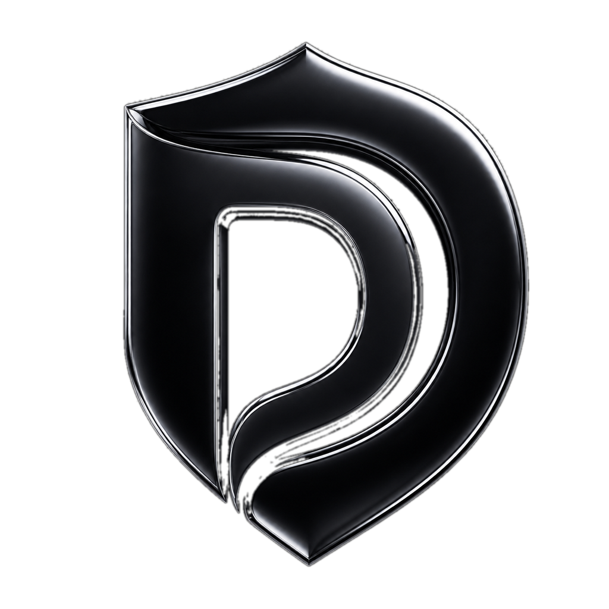
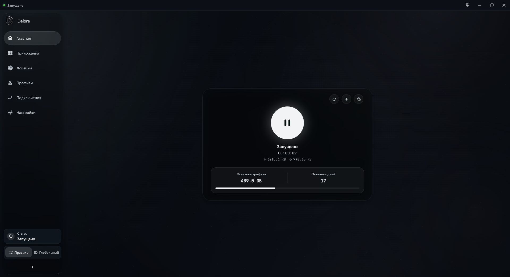
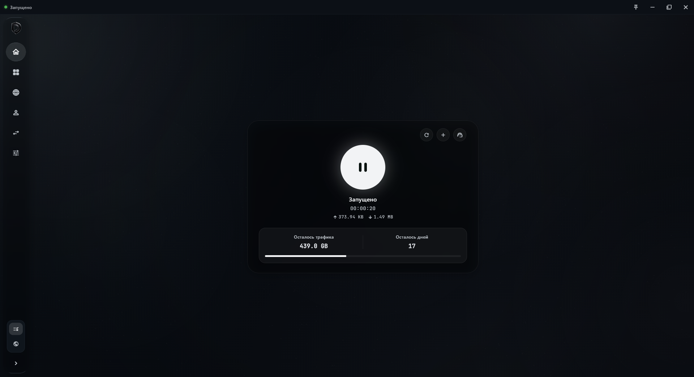
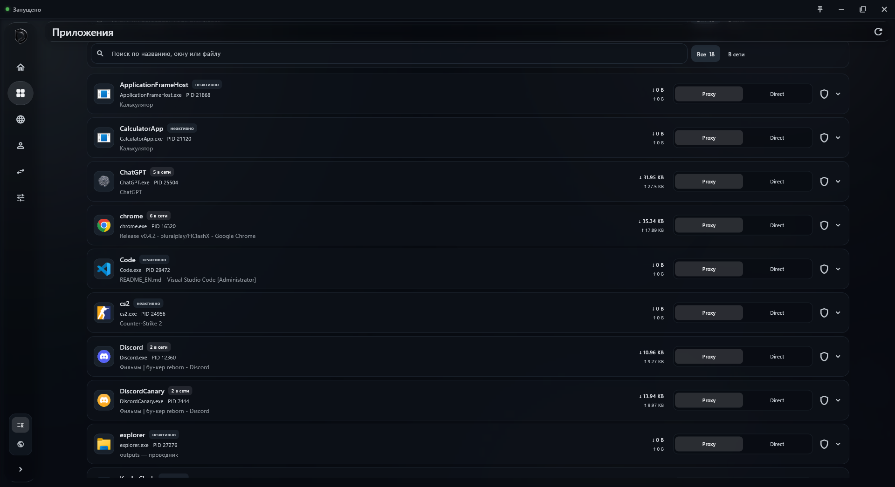

<div align="center">



# Delore

### Управляйте маршрутизацией приложений, а не YAML-файлами

[**English**](README_EN.md)

[](https://github.com/DeLorean-bot/Delore/releases)
[](https://github.com/DeLorean-bot/Delore/releases/latest)
[](LICENSE)
[](https://flutter.dev)
[](https://github.com/MetaCubeX/mihomo)

Открытый кроссплатформенный клиент на базе **FlClashX** и **mihomo**<br>
с тёмным интерфейсом и визуальной маршрутизацией трафика отдельных приложений.

[Скачать](https://github.com/DeLorean-bot/Delore/releases/latest) ·
[Возможности](#возможности) ·
[Сборка](#сборка-из-исходников) ·
[Сообщить о проблеме](https://github.com/DeLorean-bot/Delore/issues)

</div>

> [!WARNING]
> Delore находится в активной разработке. Основные сетевые функции уже унаследованы от FlClashX, но новый интерфейс и маршрутизация приложений продолжают дорабатываться. Перед обновлением сохраняйте важные профили.

## Что такое Delore

Delore превращает привычный Clash-клиент в понятный инструмент для обычного пользователя. Вместо ручного редактирования правил можно открыть список запущенных программ, увидеть их сетевую активность и выбрать маршрут: **Proxy**, **Direct** или конкретную локацию.

Проект основан на [FlClashX](https://github.com/pluralplay/FlClashX), который развивает [FlClash](https://github.com/chen08209/FlClash), и использует ядро [mihomo](https://github.com/MetaCubeX/mihomo). Delore сохраняет совместимость с профилями, подписками, TUN, системным прокси, правилами и провайдерами, но строит поверх них собственный интерфейс.

## Интерфейс

### Главная — раскрытая панель



<details>
<summary><strong>Главная — компактная панель</strong></summary>

<br>


</details>

### Приложения и маршруты



## Возможности

| Возможность | Что получает пользователь |
|---|---|
| **Маршрутизация приложений** | Список открытых программ Windows с настоящими иконками, PID, exe, заголовком окна, сетевой активностью и выбором Proxy/Direct |
| **Маршрут через локацию** | Для приложения можно выбрать не только общий Proxy, но и конкретную группу или локацию |
| **Понятная главная** | Подключение, профиль, остаток трафика, срок подписки и скорость — на одном экране |
| **Тёмная дизайн-система** | Монохромный интерфейс, стеклянные поверхности, адаптивная боковая панель и мягкие анимации |
| **Профили и подписки** | Импорт по ссылке, QR-коду и файлу, автообновление и обновление через активный прокси |
| **Режимы работы** | TUN, системный прокси, Rules, Global и Direct |
| **Диагностика** | Подключения, журналы, проверка задержки, трафик и встроенная панель управления |
| **Интеграции провайдеров** | Кастомные заголовки подписки, виджеты, объявления, поддержка и брендирование сервиса |

> [!NOTE]
> Обнаружение процессов и индивидуальная маршрутизация приложений сейчас доступны на Windows. Остальные функции клиента работают на поддерживаемых платформах в пределах возможностей FlClashX.

## Скачать

Релизы создаются автоматически при публикации тега и содержат установщики для реально поддерживаемых платформ.

| Система | Загрузка |
|---|---|
| **Android** | [Universal APK](https://github.com/DeLorean-bot/Delore/releases/latest/download/Delore-android-universal.apk) · [ARM64](https://github.com/DeLorean-bot/Delore/releases/latest/download/Delore-android-arm64-v8a.apk) · [ARMv7](https://github.com/DeLorean-bot/Delore/releases/latest/download/Delore-android-armeabi-v7a.apk) · [x86_64](https://github.com/DeLorean-bot/Delore/releases/latest/download/Delore-android-x86_64.apk) |
| **Windows** | [Установщик x64](https://github.com/DeLorean-bot/Delore/releases/latest/download/Delore-windows-amd64-setup.exe) · [Portable x64](https://github.com/DeLorean-bot/Delore/releases/latest/download/Delore-windows-amd64.zip) · [Установщик ARM64](https://github.com/DeLorean-bot/Delore/releases/latest/download/Delore-windows-arm64-setup.exe) · [Portable ARM64](https://github.com/DeLorean-bot/Delore/releases/latest/download/Delore-windows-arm64.zip) |
| **macOS** | [Apple Silicon](https://github.com/DeLorean-bot/Delore/releases/latest/download/Delore-macos-arm64.dmg) · [Intel](https://github.com/DeLorean-bot/Delore/releases/latest/download/Delore-macos-amd64.dmg) |
| **Linux** | [AppImage x64](https://github.com/DeLorean-bot/Delore/releases/latest/download/Delore-linux-amd64.AppImage) · [DEB x64](https://github.com/DeLorean-bot/Delore/releases/latest/download/Delore-linux-amd64.deb) · [RPM x64](https://github.com/DeLorean-bot/Delore/releases/latest/download/Delore-linux-amd64.rpm) · [DEB ARM64](https://github.com/DeLorean-bot/Delore/releases/latest/download/Delore-linux-arm64.deb) · [RPM ARM64](https://github.com/DeLorean-bot/Delore/releases/latest/download/Delore-linux-arm64.rpm) |
| **iOS / iPadOS** | **Планируется.** В текущем дереве проекта ещё нет iOS target, поэтому готовый `.ipa` пока не публикуется |

Если прямая ссылка ещё не появилась, откройте страницу [всех релизов](https://github.com/DeLorean-bot/Delore/releases).

## Поддержка платформ

| Функция | Windows | Android | macOS | Linux | iOS |
|---|:---:|:---:|:---:|:---:|:---:|
| Профили, подписки и правила | ✅ | ✅ | ✅ | ✅ | 🚧 |
| TUN / VPN-режим | ✅ | ✅ | ✅ | ✅ | 🚧 |
| Системный прокси | ✅ | — | ✅ | ✅ | — |
| Android TV и 120 Гц | — | ✅ | — | — | — |
| Нативная строка состояния | — | — | ✅ | — | — |
| Список приложений и маршрутизация по процессам | ✅ | — | — | — | 🚧 |

## Быстрый старт

1. Скачайте подходящий файл из [последнего релиза](https://github.com/DeLorean-bot/Delore/releases/latest).
2. Установите Delore или распакуйте portable-версию.
3. Добавьте подписку по ссылке, QR-коду или из файла.
4. Выберите профиль и запустите подключение.
5. На Windows откройте **Приложения** и назначьте нужным программам Proxy или Direct.

## Сборка из исходников

Понадобятся Flutter 3.41.x, Dart 3.5 или новее, Git и инструменты сборки выбранной платформы.

```bash
git clone https://github.com/DeLorean-bot/Delore.git
cd Delore
flutter pub get
```

Локальный запуск:

```bash
flutter run
```

Пример release-сборки для Windows:

```bash
flutter build windows --release
```

Полный релизный конвейер проекта запускается тегом вида `v0.4.3` и собирает Android, Windows, macOS и Linux через GitHub Actions.

## Интеграция с подписками

Delore сохраняет техническую совместимость с заголовками FlClashX. Их имена намеренно не переименованы, чтобы существующие панели продолжали работать.

<details>
<summary><strong>Основные заголовки провайдера</strong></summary>

| Заголовок | Назначение |
|---|---|
| `flclashx-widgets` | Порядок виджетов на главной |
| `flclashx-view` | Компоновка главной страницы |
| `flclashx-background` | Фон интерфейса |
| `flclashx-servicename` | Название сервиса |
| `flclashx-servicelogo` | Логотип сервиса |
| `flclashx-override` | Удалённый override-конфиг |
| `flclashx-globalmode` | Набор режимов прокси |
| `flclashx-buyplan` | Ссылка покупки подписки |
| `flclashx-buytraffic` | Ссылка покупки трафика |

</details>

## Участие в проекте

Баг-репорты, идеи по UX, переводы и pull request приветствуются:

- [сообщить об ошибке](https://github.com/DeLorean-bot/Delore/issues/new);
- [предложить функцию](https://github.com/DeLorean-bot/Delore/issues);
- проверить изменения перед отправкой: `flutter analyze`.

Не публикуйте в issue ссылки на личные подписки, ключи, токены и конфигурации с секретами.

## Благодарности

- [FlClashX](https://github.com/pluralplay/FlClashX) — непосредственная техническая база проекта;
- [FlClash](https://github.com/chen08209/FlClash) — исходный кроссплатформенный клиент;
- [mihomo](https://github.com/MetaCubeX/mihomo) — сетевое ядро;
- [liquid_glass_easy](https://github.com/AhmeedGamil/liquid_glass_easy) — shader-driven стеклянные материалы.

## Лицензия

Delore распространяется по лицензии [GNU General Public License v3.0](LICENSE). История и авторство исходных проектов сохраняются.
